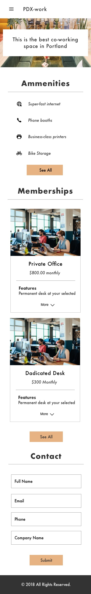

## Project Title
 PDX-Work

 Co-working Website

#### Names of Author(s)
Gary Bermudez
#### Date of Completion
2.22.2019

### Description

This is a website design for a new Co-working space. My client would like to have an on-line presence that mirrors their in-person presence. The co-working space is not catering solely the tech community, my client would like to attract artists, daytraders, craftspeople, writers, counselors, more traditional business people. The space will have a luxurious, cool, and high. This co-working space is not like the conventional more "corporative" spaces in the market, but more "funky, local and fun".
### Research, Inspire, and Brainstorm
I did some research about co-working spaces in San Francisco and get some ideas and inspirations from their websites that will help me integrate my client's request into the website. After my research I have decided to use a modern and elegant color scheme and font. The selected one unique font called "Futura". Below is an image of the color scheme and my text stules for the website.

### Images

These are the hand-drawn sketches used for the initial design of the project.

#### Desktop Version
Desktop designs are in progress.

#### Mobile Version

### Target users

* Freelancers: Software developers, designers, writers, etc.
* Starups
* Business owners
* Business incubators
* Travelers: people that needs a space for a a day or just a few hours
* Artists
* Craftspeople

### Persona

"I need a space where I can be efficient and creative"

### User Stories
* As an user of the website I would like to see information of the included amenities: conference or meeting rooms, phone booths, kitchen, etc.
* As an user of the website I would like to have access to memberships information (prices, contract details, etc)
* As an user of the website I would like to see a image gallery of the place
* As an user I would like to have the location information
* As a customer, I would like to see the co-working events and activities calendar
* As a customer, I would like to have the ability to create an account and make payment online for my membership

### Technologies and Resources

* Sketch v50.2

### Responsiveness

There is currently a mobile phone view for this project design. There will be a phone, tablet and desktop view (supporting three breakpoints).

### Setup Instructions

* Clone project from https://github.com/garybm/co-working-website
* (Mac Users) Double-click the .sketch file to open in Sketch

### Roadmap

* Add the tablet and desktop designs
* Add a registration/login page
* Add a calendar with events
* Add the mobile view menu
* 

### License

MIT License

Copyright (c) 2018 **Gary Bermudez**
